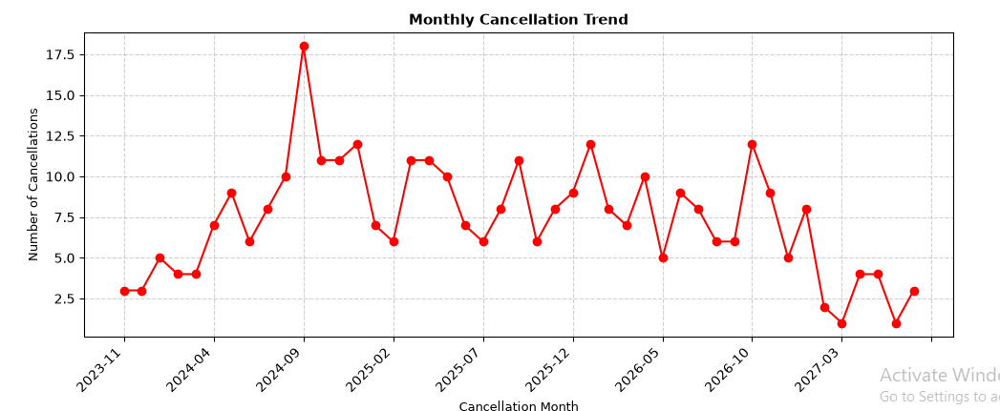
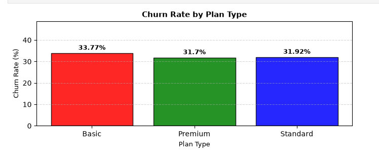
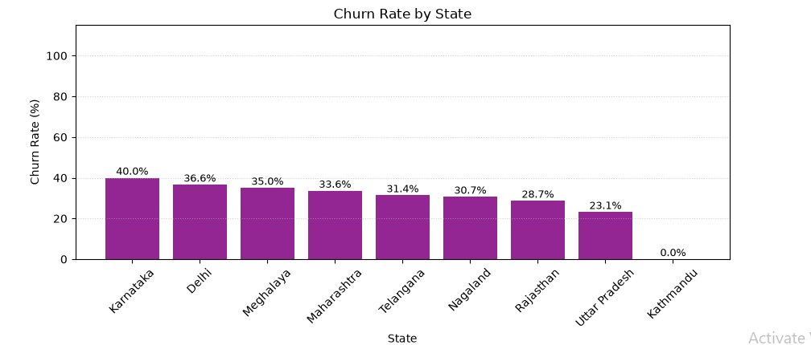
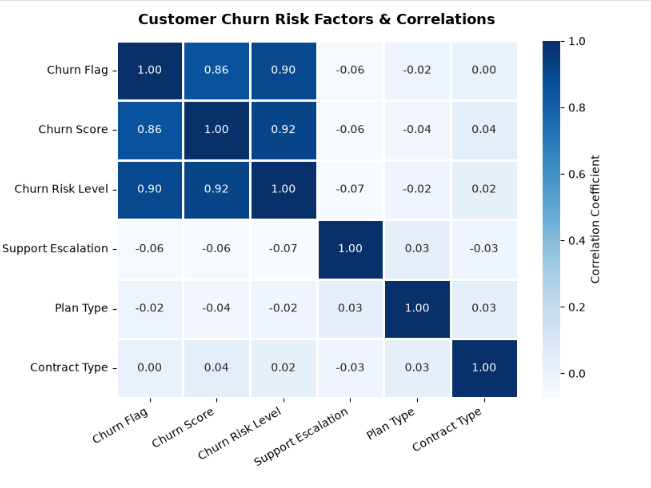
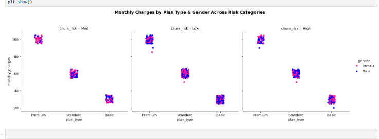

# 🎬 OTT Subscription Customer Churn Analytics

An end-to-end Python & SQL churn analysis pipeline built on 1,000+ subscriber records. This project integrates relational database querying (SQLite), feature engineering, exploratory data analysis (EDA), and data visualizations to quantify churn risk and highlight actionable retention strategies for subscription-based OTT platforms.

---

## 📌 Executive Summary & Key Metrics

* **Overall Churn Rate:** **32.42%** (67.58% Retention Rate across 1,021 subscribers)
* **Average Revenue Per User (ARPU):** **$59.58 / month**
* **Average Customer Tenure:** **471 days** (~15.7 months)
* **Total Revenue at Risk (Churn Loss):** **$19,523.70**
* **Support Escalation Rate:** **11.07%** of overall customer interactions

---

## 📊 Key Findings & Business Insights

### 1. Subscription Plan Dynamics
* **Basic Tier:** Highest churn rate at **33.77%** (302 users, generating $8,935.70 revenue).
* **Standard Tier:** Represents the largest subscriber base with 495 users ($29,658.10 revenue) and a **31.92%** churn rate.
* **Premium Tier:** Highest ARPU subscriber group with 224 users ($22,236.00 revenue) and the lowest churn rate at **31.70%**.

### 2. Geographic Segmentation
* **High-Risk Regions:** **Karnataka (40.00%)**, **Delhi (36.59%)**, and **Meghalaya (35.04%)** show the highest cancellation rates.
* **Low-Risk Regions:** **Uttar Pradesh (23.14%)** and **Rajasthan (28.69%)** demonstrate stronger long-term retention.

### 3. Customer Service Impact & Escalations
* Average support ticket density is **0.37 complaints per user**.
* Escalations show a slightly negative linear correlation (**-0.0576**) with churn, indicating that direct support resolutions help stabilize high-risk accounts.

---

## 🛠️ Tech Stack & Methodology

* **Database & Querying:** SQLite3 (Schema setup, table joins across customer demographics, subscriptions, and support complaints)
* **Data Wrangling:** Pandas, NumPy (Date transformations, standardization, missing value handling, duplicate handling)
* **Feature Engineering:**
  * `churn_flag` (Binary indicator for cancellation date presence)
  * `tenure_days` (Calculated duration from subscription start to cancellation/current date)
  * `churn_risk` (Segmented into Low, Medium, and High based on predictive churn scoring)
  * `escalations_binary` (Numerical mapping for correlation testing)
## 📈 Visualizations & Exploratory Analytics

### 1. Monthly Cancellation Trend


### 2. Churn Rate by Plan Type


### 3. Churn Rate by Regional State


### 4. Risk Factors & Feature Correlations


### 5. Multi-Dimensional Monthly Charges Across Risk Categories


---

## 📂 Repository Structure

```text
├── Monthly_cancellation_trends.png
├── churn_by_plan_types_gender_accross_risk_factors.png
├── churn_rate_by_plan_type.png
├── churn_rate_by_state.png
├── churn_risk_factor_and_corelations.png
├── churn_anlysis.ipynb
├── exported_churn_data.csv
└── README.md
```

> [!NOTE]
> ## 📊 Key Findings & Strategic Action Items
> 
> ### 1. Executive Metrics & Financial Impact
> * **Overall Churn vs. Retention:** 28.6% Churn Rate | 71.4% Retention Rate.
> * **Revenue Exposure:** 18% total revenue loss (Rs 74 lost out of Rs 395). Total CLTV lost amounts to 2,047.
> * **Customer Value:** Average Revenue Per User (ARPU) sits at Rs 18.8, with a strong Average Customer Tenure of 1,451 days.
> 
> ### 2. Behavioral & Geographic Insights
> * **Subscription Plan Dynamics:** The **Basic Plan** accounts for the vast majority of churn. While this insulates top-line revenue from severe impact, it highlights a critical vulnerability in the entry-level acquisition tier. 
> * **Contract Volatility:** Monthly subscriptions experience a disproportionately high churn rate (**55.6%**) compared to Annual commitments (**8.3%**).
> * **Geographic & Temporal Spikes:** Cancellations peaked sharply in **September 2024**, with **Karnataka** identified as the most heavily affected state.
> 
> ### 3. Recommended Action Items
> * **Conduct a Targeted Regional Audit:** Investigate the September churn anomaly in Karnataka. Cross-reference this spike with potential localized pricing updates, technical outages, or regional support ticket surges.
> * **Competitive Intelligence & Pricing Review:** Analyze competitor campaigns during the September period (leveraging explicit feedback of users switching to competitors). Assess if recent modifications to the Basic Plan inadvertently drove price sensitivity.
> * **Implement a Proactive Retention Workflow:** Segment the active user base by **'High' and 'Medium' Churn Risk**. Prioritize this cohort by their LTV and cross-reference with open support complaints. Initiate targeted, multi-channel outreach (Email/SMS/Outbound Calls) to resolve friction points and offer pre-emptive retention incentives.
>
## 👤 Author

**Abdul Wahab Jhare**  
*Data Analyst & Analytics Engineer*

I am a Data Analyst and Analytics Engineer with over 5 years of experience transforming complex, large-scale datasets (100M+ records) into actionable, revenue-driving business strategies. Specializing in sales, marketing, and reliability analytics, my expertise spans across building robust ETL pipelines, designing scalable data models (Star Schema), and tracking critical KPIs such as MTBF, MTTR, and customer conversion funnels.

Leveraging advanced SQL, Python (Pandas, NumPy), and cloud computing platforms like Databricks, AWS, and Azure, I have a proven track record of engineering solutions that solve real-world problems. My past impact includes uncovering deep behavioral segments that generated over $650K in annual recurring revenue and automating manual workflows to drastically reduce processing times. Whether developing comprehensive Power BI dashboards or conducting predictive churn analytics, I am passionate about optimizing data infrastructure and empowering stakeholders through clear data storytelling.

* **GitHub:** [@AbdulWahabJhare](https://github.com/AbdulWahabJhare)
* **LinkedIn:** [Abdul Wahab Jhare](https://www.linkedin.com/in/abdul-wahab-jhare)
* **Email:** [jhareabdul@gmail.com](mailto:jhareabdul@gmail.com)
